# Popular Psql commands

## Checking version

`select version();`

you have to give semicolon after each statement.

## Checking list of Databases

`\l`

This gives you the following result

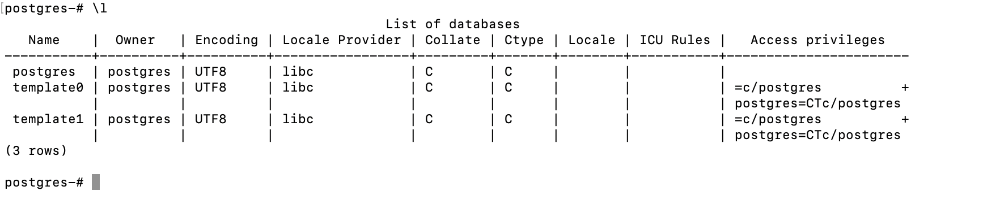

## Connect to another database

`\c <database name>`

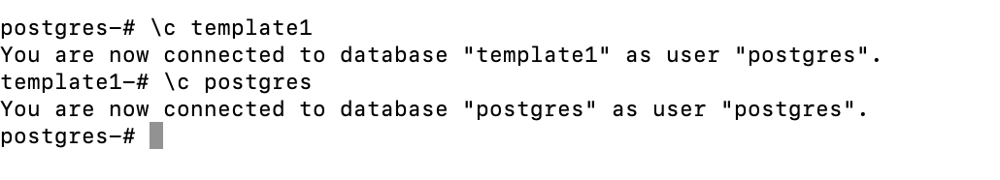

## Show connection info

`\conninfo`

it shows the connection info `You are connected to database "postgres" as user "postgres" on host "localhost" (address "::1") at port "5433".`

## Create a table 

`create table <table-name>(column-name type)`

For example: 

`create table users(name varchar(50));`

interesting fact, you can not use `user` as table name beacuse it is a `keyword`.

Here, 
- `user` is the table name
- `name` is an attribute (column) of the table
- `varchar` is the datatype

<a href='https://www.geeksforgeeks.org/postgresql-data-types/'>more about pg data types</a>

## show list of tables in a database

`\d` it describes the database and show all the objects in database like tables, views, sequences etc.

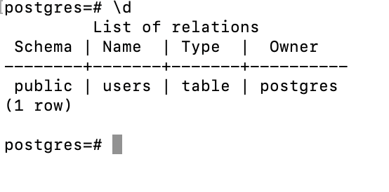

another command is `\dt` it also shows the list of tables.

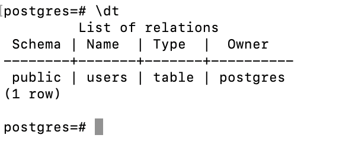

## creating a database

`create database <database-name>`

it uses `template1` as default template, you can change the template name by providing arguments in creating database command. <a href='https://www.postgresql.org/docs/current/sql-createdatabase.html'> learn more about create database </a>

# Users and Role management in postgres

## List of all roles

`\du`

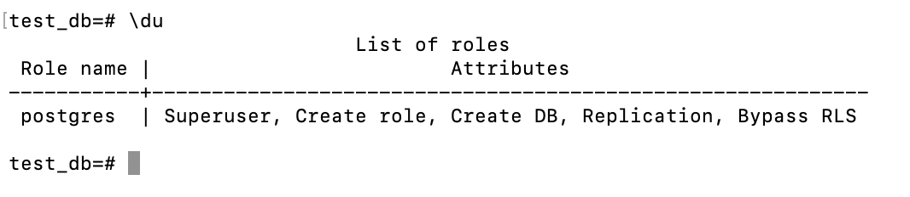

Here, attributes are the list of privileges

## creating a new user

`create user <username> with login encrypted password '<password>';`

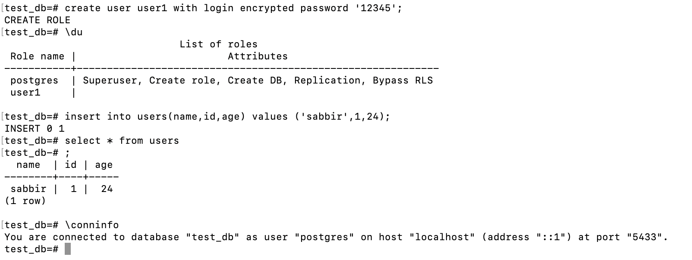

Here, we created a new user named `user1`. Initially it has no privileges. You can check the privileges by using `\du` command.

We created a table named `users` in test_db by users postgres. But user1 can not access it.

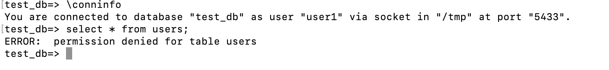

## Granting privileges to user
`grant <privilege> on <object> to <user>;`

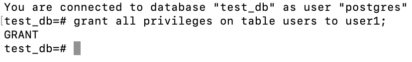

now user1 can access the table `users` and can insert data into it.

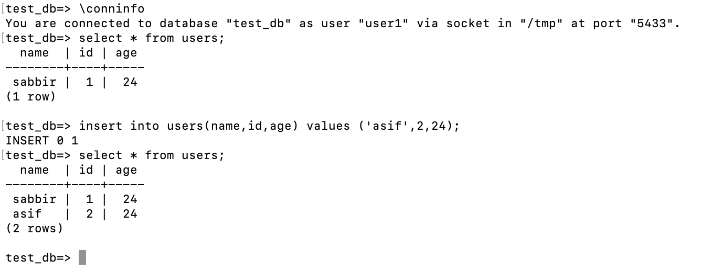

## Granting only select privilege

`grant select on <object> to <user>;`

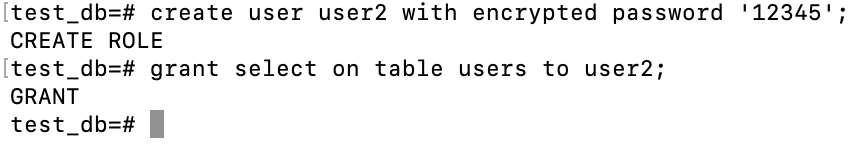

now user1 can only select the data from the table `users` but can not insert or update or delete the data.

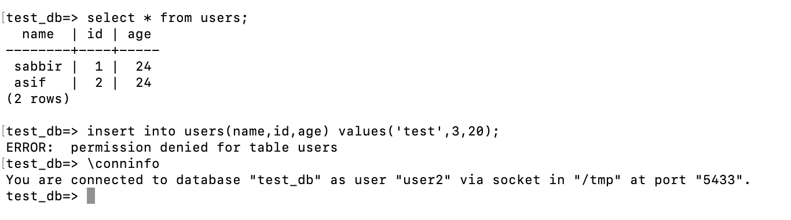

## Removing privileges
`revoke <privilege> on <object> from <user>;`

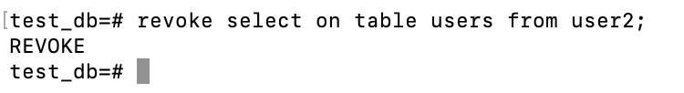

Now, user2 can not access the table `users` anymore.

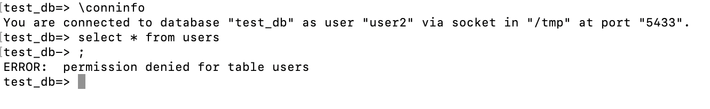

## Grant a role to a user

`grant <role> to <user>;`

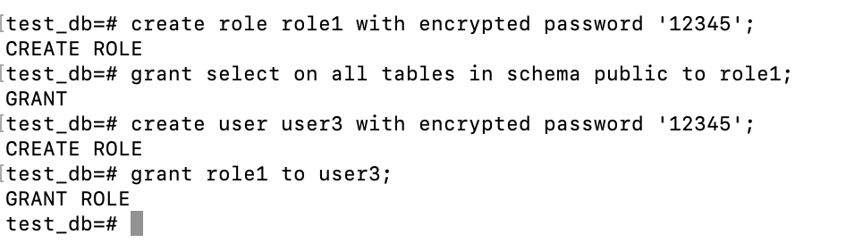

Here, user3 is granted role1 so user3 can select data from all tables but can not insert anything.

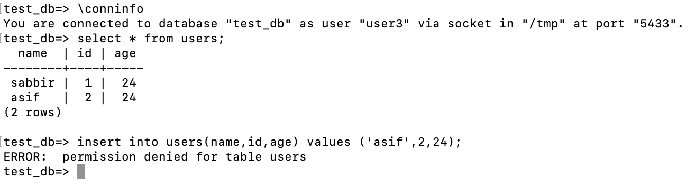